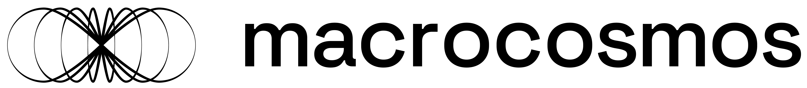

<picture>
    <source srcset="./assets/macrocosmos-white.png"  media="(prefers-color-scheme: dark)">
    
</picture>

<picture>
    <source srcset="./assets/macrocosmos-black.png"  media="(prefers-color-scheme: light)">
    
</picture>


<br/>
<br/>
<br/>

# Subnet 1 API
> Note: This project is still in development and is not yet ready for production use.

The official REST API for Bittensor's flagship subnet 1 ([prompting](https://github.com/opentensor/prompting)), built by [Macrocosmos](https://macrocosmos.ai).

Subnet 1 is an decentralized open source network containing around 1000 highly capable LLM agents. These agents are capable of performing a wide range of tasks, from simple math problems to complex natural language processing tasks. As subnet 1 is constantly evolving, its capabilities are always expanding. Our goal is to provide a world-class inference engine, to be used by developers and researchers alike.

This API is designed to power applications and facilitate the interaction between subnets by providing a simple and easy-to-use interface for developers which enables:
1. **Conversation**: Chatting with the network (streaming and non-streaming)
2. **Data cleaning**: Filtering empty and otherwise useless responses
3. **Advanced inference**: Providing enhanced responses using SOTA ensembling techniques (WIP)

Validators can use this API to interact with the network and perform various tasks.
To run an API server, you will need a bittensor wallet which is registered as a validator the relevant subnet (1@mainnet or 61@testnet).

NOTE: At present, miners are choosing not to stream their responses to the network. This means that the server will not be able to provide a streamed response to the client until the miner has finished processing the request. This is a temporary measure and will be resolved in the future.

## How it works
The API server is a RESTful API (written using FastAPI) that provides endpoints for interacting with the network. It is a simple [wrapper](./validators/sn1_validator_wrapper.py) around your subnet 1 validator, which makes use of the dendrite to make queries.

## Install
Ensure that you have a cuda-capable machine and run
```
poetry install
```
to install all packages

> Note: Currently the prompting library is only installable on machines with cuda devices (NVIDIA-GPU).

## Run

First activate the virtual environment:

```bash
poetry shell
```

Then, set up your .env file by adding the openai key (if you want to run tests using openai) and the API key that you'd like
to use to secure the API (optional).

### Testing with OpenAI

Now you can either run the API in test mode (provided you have created a .env file with an openai key) where it will simply connect to openai. This is recommended when you're
e.g. developing a frontend and want fast/easy response times without having to set up your wallet/hotkey etc.

```
python api.py --test
```

### Running On SN1

Run an API server on subnet 61 (test subnet) with the following command:

```bash
python api.py --wallet.name <WALLET_NAME> --wallet.hotkey <WALLET_HOTKEY> --netuid <NETUID> --neuron.model_id mock --neuron.tasks math --neuron.task_p 1 --neuron.device cpu --subtensor.network test
```

The command ensures that no GPU memory is used by the server, and that the large models used by the incentive mechanism are not loaded.

> Note: This command is subject to change as the project evolves.

We recommend that you run the server using a process manager like PM2. This will ensure that the server is always running and will restart if it crashes.

```bash
pm2 start api.py --interpreter python3 --name sn1-api -- --wallet.name <WALLET_NAME> --wallet.hotkey <WALLET_HOTKEY> --netuid <NETUID> --neuron.model_id mock --neuron.tasks math --neuron.task_p 1 --neuron.device cpu
```

### Run with Docker (WARNING: currently not supported)

To run api in docker container you have to build the image:
```
docker build . -t prompting-api
```
after the image is build properly
you can start it with command:

```
docker run -e EXPECTED_ACCESS_KEY=<ACCESS_KEY> prompting-api:latest --interpreter python3 --name sn1-api -- --wallet.name <WALLET_NAME> --wallet.hotkey <WALLET_HOTKEY> --netuid <NETUID> --neuron.model_id mock --neuron.tasks math --neuron.task_p 1 --neuron.device cpu
```

## API Usage
At present, the API provides two endpoints: `/chat` (live) and `/echo` (test).

`/chat` is used to chat with the network and receive a response. It requires a JSON payload structured as per the QueryValidatorParams class.
The request payload requires the following parameters encapsulated within the [`QueryValidatorParams`](./validators/base.py) data class:
- `k: int`: The number of miners from which to request responses.
- `exclude: List[str]`: A list of roles or agents to exclude from querying.
- `roles: List[str]`: The roles of the agents to query.
- `messages: List[str]`: The messages to be sent to the network.
- `timeout: int`: The time in seconds to wait for a response.
- `prefer: str`: The preferred response format, can be either `'longest'` or `'shortest'`.
- `request: Request`: The original request object encapsulating all request data.
- `sampling_mode: str`: The mode of sampling to use, defaults to `"random"`. Can be either `"random"` or `"top_incentive"`

Responses from the `/chat` endpoint are handled by two classes: `StreamChunk` and `StreamError`, with their attributes defined as follows:
- `StreamChunk`:
  - `delta: str`: The new chunk of response received.
  - `finish_reason: Optional[str]`: The reason for the response completion, if applicable Can be `None`, `finished` or `error` (check StreamError below).
  - `accumulated_chunks: List[str]`: All chunks of responses accumulated thus far.
  - `accumulated_chunks_timings: List[float]`: Timing for each chunk received.
  - `timestamp: str`: The timestamp at which the chunk was processed.
  - `sequence_number: int`: A sequential identifier for the response part.
  - `selected_uid: int`: The identifier for the selected response source.

- `StreamError`:
  - `error: str`: Description of the error occurred.
  - `timestamp: str`: The timestamp of the error.
  - `sequence_number: int`: A sequential identifier for the error.
  - `finish_reason: str`: Always set to `'error'` to indicate an error completion.

> Note: The API is subject to change as the project evolves.

## Testing Locally
To test the API locally, you can use the following curl command:

```bash
curl --no-buffer -X POST http://0.0.0.0:10000/chat/ -H "api_key: <ACCESS_KEY>" -H "Content-Type: application/json" -d '{"k": 5, "timeout": 15, "roles": ["user"], "messages": ["Tell me a happy story about a rabbit and a turtle that meet on a budget cruise around Northern Ireland"]}'
```
> Note: Use the `--no-buffer` flag to ensure that the response is streamed back to the client.

The above example prompt yields the following.

Streamed response:
```
Once upon a time, a rabbit named Rosie and a turtle named Tim embarked on a budget cruise around Northern Ireland. Despite their differences in speed, Rosie's energetic hopping and Tim's slow but steady pace, they quickly became friends during the voyage. \n\nAs they explored the stunning landscapes and quaint villages along the coast, Rosie and Tim discovered a shared love for adventure and new experiences. They enjoyed sampling local cuisine, attending traditional music sessions, and participating in fun onboard activities.\n\nOne memorable evening, under the shimmering Northern Lights, Rosie and Tim danced together on the deck, celebrating their unlikely friendship and the beauty of the world around them. Their bond transcended their differences, proving that true companionship knows no boundaries.\n\nAt the end of the cruise, as they bid farewell to their fellow travelers and the enchanting sights of Northern Ireland, Rosie and Tim knew that their special connection would last a lifetime. And so, with hearts full of joy and memories to cherish, the rabbit and the turtle set off on new adventures, forever grateful for the magical journey they shared.
```
Final JSON:
```json
{\"streamed_chunks\": [\"Once upon a time, a rabbit named Rosie and a turtle named Tim embarked on a budget cruise around Northern Ireland. Despite their differences in speed, Rosie's energetic hopping and Tim's slow but steady pace, they quickly became friends during the voyage. \\\\n\\\\nAs they explored the stunning landscapes and quaint villages along the coast, Rosie and Tim discovered a shared love for adventure and new experiences. They enjoyed sampling local cuisine, attending traditional music sessions, and participating in fun onboard activities.\\\\n\\\\nOne memorable evening, under the shimmering Northern Lights, Rosie and Tim danced together on the deck, celebrating their unlikely friendship and the beauty of the world around them. Their bond transcended their differences, proving that true companionship knows no boundaries.\\\\n\\\\nAt the end of the cruise, as they bid farewell to their fellow travelers and the enchanting sights of Northern Ireland, Rosie and Tim knew that their special connection would last a lifetime. And so, with hearts full of joy and memories to cherish, the rabbit and the turtle set off on new adventures, forever grateful for the magical journey they shared.\"], \"streamed_chunks_timings\": [4.6420252323150635], \"uid\": 559, \"completion\": \"Once upon a time, a rabbit named Rosie and a turtle named Tim embarked on a budget cruise around Northern Ireland. Despite their differences in speed, Rosie's energetic hopping and Tim's slow but steady pace, they quickly became friends during the voyage. \\\\n\\\\nAs they explored the stunning landscapes and quaint villages along the coast, Rosie and Tim discovered a shared love for adventure and new experiences. They enjoyed sampling local cuisine, attending traditional music sessions, and participating in fun onboard activities.\\\\n\\\\nOne memorable evening, under the shimmering Northern Lights, Rosie and Tim danced together on the deck, celebrating their unlikely friendship and the beauty of the world around them. Their bond transcended their differences, proving that true companionship knows no boundaries.\\\\n\\\\nAt the end of the cruise, as they bid farewell to their fellow travelers and the enchanting sights of Northern Ireland, Rosie and Tim knew that their special connection would last a lifetime. And so, with hearts full of joy and memories to cherish, the rabbit and the turtle set off on new adventures, forever grateful for the magical journey they shared.\", \"timing\": 4.720629930496216}"
```
After verifying that the server is responding to requests locally, you can test the server on a remote machine.

## OpenAPI
To access OpenAPI specification, go to:
[http://localhost:10000/docs](http://localhost:10000/docs)

### Troubleshooting

If you do not receive a response from the server, check that the server is running and that the port is open on the server. You can open the port using the following commands:

```bash
sudo ufw allow 10000/tcp
```

---

## Contributing
If you would like to contribute to the project, please read the [CONTRIBUTING.md](CONTRIBUTING.md) file for more information.

You can find out more about the project by visiting the [Macrocosmos website](https://macrocosmos.ai) or by joining us in our social channels:


[](https://substack.com/@macrocosmosai)
[](https://twitter.com/MacrocosmosAI)
[](https://twitter.com/MacrocosmosAI)
[](www.linkedin.com/in/MacrocosmosAI)
[](https://opensource.org/licenses/MIT)
